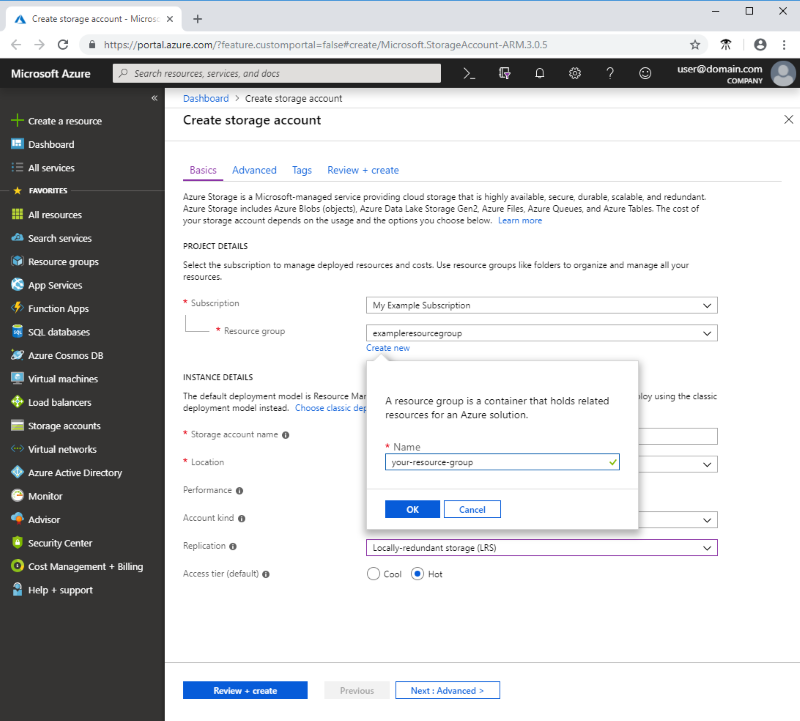
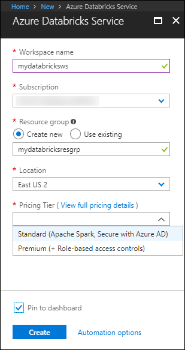

## 0.1 Azure Subscription

## 0.2 Create Resource Group 

Create Resource Group **AutoML-RG**

## 0.3 Create Azure Machine Learning Workspace

To create workspace, follow step: https://docs.microsoft.com/en-us/azure/machine-learning/service/how-to-manage-workspace

## 0.4 Create Azure Storage Account

To create a general-purpose v2 storage account in the Azure portal, follow these steps:
1. In the Azure portal, select All services. In the list of resources, type Storage Accounts. As you begin typing, the list filters based on your input. Select Storage Accounts.
2. On the Storage Accounts window that appears, choose Add.
3. Select the subscription in which to create the storage account.
4. Under the Resource group field, select Create new. Enter a name for your new resource group, as shown in the following image.

5. Next, enter a name for your storage account. The name you choose must be unique across Azure. The name also must be between 3 and 24 characters in length, and can include numbers and lowercase letters only.
6. Select a location for your storage account, or use the default location.
7. Leave these fields set to their default values: 
	Field|Value
    -----------------|--------------------------
	Deployment model|Resource Manager
	Performance|Standard
	Account kind|StorageV2 (general-purpose v2)
	Replication|Locally redundant storage (LRS)
	Access tier|Hot
8. Select Review + Create to review your storage account settings and create the account.
9. Select Create.
For more information about types of storage accounts and other storage account settings, see Azure storage account overview. For more information on resource groups, see Azure Resource Manager overview.

## 0.5 Create Azure Databricks Workspace

### Create an Azure Databricks workspace

#### Log in to the Azure portal
Log in to the [Azure portal](https://portal.azure.com/).

#### Create an Azure Databricks workspace

Create an Azure Databricks workspace using the Azure portal.

1. In the Azure portal, select **Create a resource** &gt; **Data + Analytics** &gt; **Azure Databricks**. 

2. Under **Azure Databricks Service**, provide the values to create a Databricks workspace. Provide the following values: 

PropertyDescription

 **Workspace name** Provide a name for your Databricks workspace

 **Subscription** From the drop-down, select your Azure subscription.

 **Resource group** Specify whether you want to create a new resource group or use an existing one. A resource group is a container that holds related resources for an Azure solution. For more information, see [Azure Resource Group overview](https://docs.microsoft.com/en-us/azure/azure-resource-manager/resource-group-overview).

 **Location** Select **East US 2**. For other available regions, see [Azure services available by region](https://azure.microsoft.com/regions/services/).

 **Pricing Tier** Choose between **Standard** or **Premium**. For more information on these tiers, see [Databricks pricing page](https://azure.microsoft.com/pricing/details/databricks/). Select **Pin to dashboard** and then click **Create**. 
3. The workspace creation takes a few minutes. During workspace creation, the portal displays the **Submitting deployment for Azure Databricks** tile on the right side. You may need to scroll right on your dashboard to see the tile. There is also a progress bar displayed near the top of the screen. You can watch either area for progress.

### Configure Azure Databricks Environment for Automated Machine Learning

Set-up Databricks Environment: https://docs.microsoft.com/en-us/azure/machine-learning/service/how-to-configure-environment#azure-databricks

#### For Auto ML !!

Use these settings:

Setting|Applies to|Value
----------------------------------------------|--------------------|----------------------------
Cluster name |always|yourclustername
Databricks Runtime|always|Any non ML runtime (non ML 4.x, 5.x)
Python version|always|3
Workers|always|2 or higher Worker node VM types
(determines max # of concurrent iterations)|**Automated ML only**|Memory optimized VM preferred
Enable Autoscaling|**Automated ML only**|Uncheck

**Warning No other SDK extras can be installed.**

For Databricks -with-automated ML capabilities Upload Python Egg or PyPI azureml-sdk[automl_databricks]

- Do not select Attach automatically to all clusters.
- Select Attach next to your cluster name.